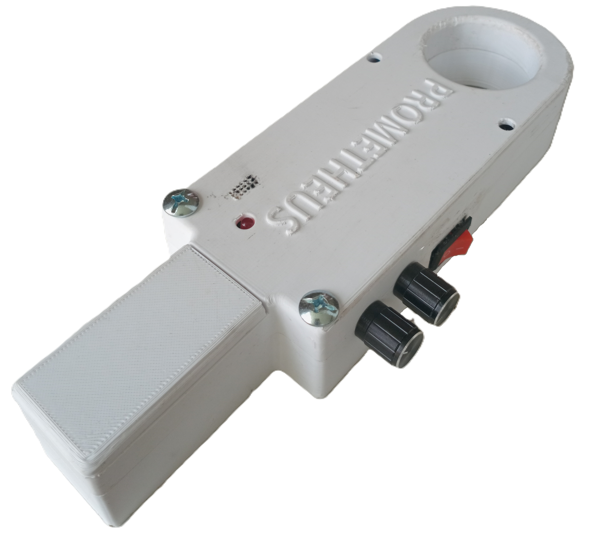
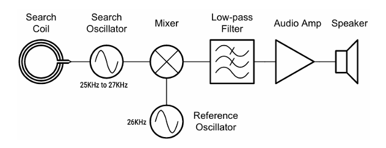
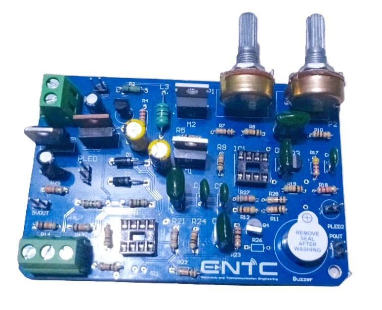
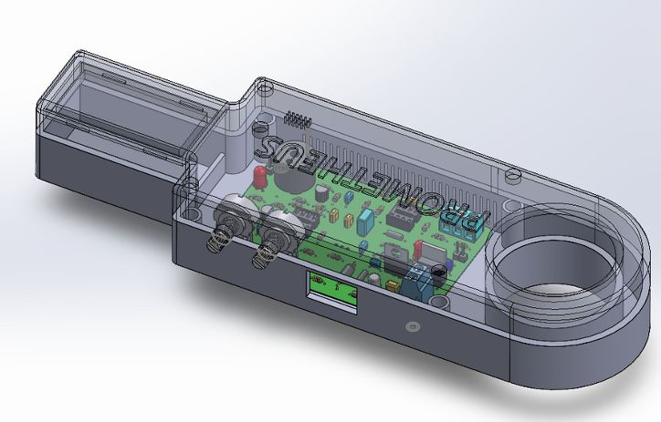
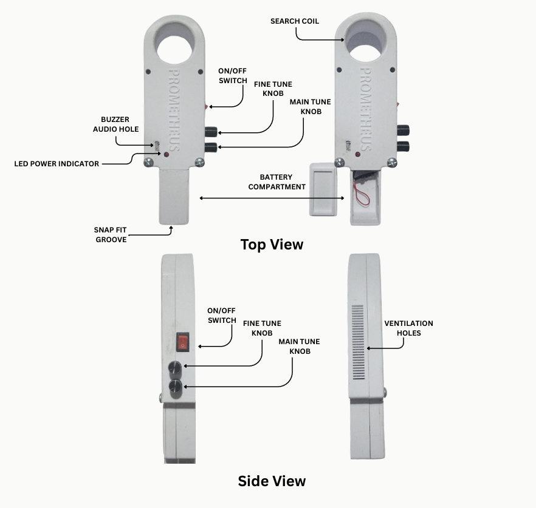

# Prometheus - Handheld Analog Metal Detector

## Overview
The Prometheus metal detector is an analog sensing and detection system that identifies metallic objects by monitoring perturbations in an electromagnetic field produced by a driven search coil. It is designed for detecting both magnetic and non-magnetic metal objects, making it suitable for close-range security screening, personnel inspection, and educational demonstrations of analog electronics. 

This project was developed by Team Prometheus as part of the EN2091 Laboratory Practice and Projects module at the University of Moratuwa.

## Key Features
* **Fully Analog Design:** Utilizes a completely analog circuit design without digital processing, ensuring a real-time response.
* **Inductive Detection:** Features a search coil excitation at approximately 26 kHz, driven by an MCP6002 dual op-amp based oscillator and comparator.
* **Audible Feedback:** Provides a built-in buzzer for audible indication, which increases in frequency when a metal is detected.
* **Adjustable Sensitivity:** Includes adjustable sensitivity controls (Main and Fine tune knobs) for adapting to slow or fast movements and calibrating to changing environments.
* **Portable and Efficient:** Offers a low-power and compact circuit design, capable of continuous work for up to 3 hours on a standard 9V battery.

## System Architecture

The system operates on the Beats Frequency Oscillator (BFO) principle, which relies on the interaction between two primary oscillators. 
* **Search Oscillator:** Contains a center-tapped inductor coil (800μH) that changes its inductance when a metal object is brought closer, consequently shifting the oscillator's frequency, which naturally runs between 25kHz and 27kHz. 
* **Reference Oscillator:** A standard hysteresis square waveform generator implemented using an MCP6002 OpAmp to produce a stable 5V, 25kHz near-square wave.
* **Mixer and Low-Pass Filter:** The frequencies from the two oscillators are mixed together, and a first-order low-pass filter with a cutoff frequency of approximately 723 Hz isolates the difference (beat frequency) to fall within the audible range.
* **Fixed Length Square Pulse Shaper:** To provide a distinct trigger sound, the filtered output passes through a high-pass filter and hysteresis comparators to generate fixed-length square pulses. These pulses ensure that a higher intensity metal object produces faster, distinct clicks on the buzzer.

## Hardware & Enclosure

The circuit relies heavily on the MCP6002 dual op-amp due to its ability to work with a single power supply (1.8V to 6V), rail-to-rail output, and low quiescent current, which is ideal for battery-powered portable detectors. The hardware features a custom PCB layout specifically designed to minimize EMI and cross-coupling.

## Technical Specifications
* **Operating Frequency:** 26 KHz.
* **Power Supply:** Standard 9 V (6F22) battery.
* **Power Consumption:** <60mW during normal operation.
* **Detection Capability:** Capable of detecting metals as small as coin-sized objects at a maximum distance of 30mm.
* **Operating Temperature:** -20°C to 55°C.
* **Weight:** 300 g (0.66 lb) excluding the battery.

## Usage & Calibration Instructions

1. **Power Setup:** Connect a standard 9V battery and ensure the search coil is kept away from any metal objects.
2. **Startup:** Power the circuit ON using the ON/OFF switch.
3. **Coarse Tuning:** Adjust the main tune knob until you hear a steady, low-frequency tone.
4. **Fine Tuning:** Adjust the fine tune knob until no sound is heard.
5. **Operation:** Slowly move the search coil over the target area; the buzzer tone frequency will increase based on the object's size, distance, and material. 
6. **Recalibration:** If the tone drifts slowly over time due to temperature changes, simply re-adjust the fine-tune knob.

## Troubleshooting
* **No audio output:** Check if the buzzer is connected properly, or measure the 5V regulator output to verify the 9V input is functioning.
* **Constant loud tone:** The threshold is set too high; adjust the main tune knob to recalibrate.
* **Detector triggers continuously:** You may be near large metal objects; move to a metal-free area and recalibrate.

## Authors & Acknowledgments

* **Team EchoWave** (Department of Electronic & Telecommunication Engineering, University of Moratuwa): *(From Left to Right)*  
  * Samarasinghe S.M.R.R. - 230566U
  * Eranga W.A.O. - 230175U
  * Gamage S.K. - 230195F
  * Tharushika G.K.E. - 230636K
